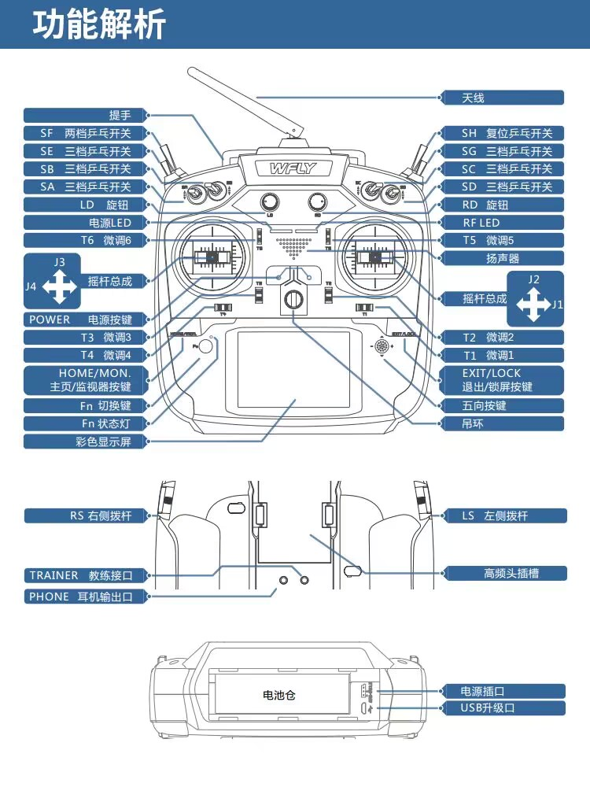

### 1.

使用的是cubemax6.2.1生成的Freertos和LWIP

### 2.

使用的ip端口为：192.168.1.200

通信协议说明：

|          | 帧头    | 数据长度 | 控制方式                                                   | Yaw轴目标角度                                                | Pitch轴目标角度                                              | 和校验                                                       |
| -------- | ------- | -------- | ---------------------------------------------------------- | ------------------------------------------------------------ | ------------------------------------------------------------ | ------------------------------------------------------------ |
| 数据类型 | Uint8_t | Uint8_t  | Int8_t                                                     | Int32                                                        | Int32                                                        | uint8_t                                                      |
| 数据内容 | 0xFF    | 9        | 0：相对角度控制(编码器闭环）1:绝对角度控制(陀螺仪数据闭环) | 相对角度控制模式下为YAW轴相对当前角度偏移的角度；绝对角度控制模式下为为相对当前yaw轴角度偏移的角度 | 相对角度控制模式下为PITCH轴相对当前角度偏移的角度；绝对角度控制模式下为相对当前yaw轴角度偏移的角度 | 从帧头0xFF字节开始，一直到Pitc轴目标角度 ，对每一字节进行累加操作，只取低8位。 |


注：使用的是右手系

一个数据长度指代一个int8，参考木鸢通信协议：[[木鸢通讯协议 — Bubble v1.0 documentation](https://birdiebot.github.io/bubble_documentation/guide/木鸢通讯协议.html#:~:text=木鸢通讯协议是一个针对RMU定制的上下位机通讯协议， 木鸢通讯协议包含在BTPDM、Bubble等开源项目中，鼓励在尊重著作权基础上对木鸢通讯协议进行使用、修改和二次发布。,为了适应Robomaster赛场多种数据类型的传输，保证高效的通信效率，MCU与上位机之间的数据传输遵守BCP（Birdiebot Communication Protocol，Birdiebot通讯协议）格式。)](#:~:text=木鸢通讯协议是一个针对RMU定制的上下位机通讯协议， 木鸢通讯协议包含在BTPDM、Bubble等开源项目中，鼓励在尊重著作权基础上对木鸢通讯协议进行使用、修改和二次发布。,为了适应Robomaster赛场多种数据类型的传输，保证高效的通信效率，MCU与上位机之间的数据传输遵守BCP（Birdiebot Communication Protocol，Birdiebot通讯协议）格式。)

### 3.

使用的电机为大疆的2006电机及配套C610电调和RoboMaster 机甲大师 电调中心板2，使用的电池为TB48s(其实能24v供电就行）。使用的遥控器是天地飞et16s，对应通信协议为WBUS（兼容SBUS和DBUS，只需按原本的规律结合遥控器拨杆数进行增删即可）

使用说明：

SB拨到中间为编码器闭环的相对控制模式,拨到上面和下面均为失能电机

将SC拨到中间为陀螺仪数据闭环的绝对角度控制。

SB和SC同时拨到中间则为绝对角度控制（SC的判断在SB之后）。

当上一次控制模式为绝对角度控制时，将SC拨到上面，则失能电机。

将SC拨到下面则为失能电机。

注：

（1）因为要使pitch和yaw轴从转动范围边界到转动范围中间需要编码器旋转多圈，故无法通过编码器固定云台初始位置。而陀螺仪存在误差和漂移，用来确认初始位置并不可靠，故无法通过陀螺仪固定云台初始位置。后续如果需在每次启动时让云台归位到固定位置需更换电机或优化机械结构。

（2）因机械结构的缘故，pitch不能360度旋转，否则会损伤内部线路，因此设置有软件限位。相对角度控制下pitch限位为-80-145，绝对角度控制下pitch限位为-70-140.可能需根据实际机械安装情况更改，相关代码在src/task/gimbal/gimbal_task文件中的motor_control_pitch函数内。此外，因为相对角度下未使用姿态角闭环，而有仅可通过姿态角进行限位，相对角度下限位效果不好，猛推遥杆时可能会出现pitch轴超出限位而无法运动的情况，建议此时切换至绝对角度下调整位置再切换回相对角度进行控制。实际上以注释掉相对角度下限位，操作时注意pitch轴转动的角度即可。后续可能更换电机或修改机械结构以实现可用编码器确认云台准确姿态。

(3) 目前代码存在bug，建议不能移动云台时切换控制模式或RESET。云台上电时一定要先开启遥控器。电机或板子上电后一定要RESET一遍。可能出现连接不上上位机的情况，建议复位。


### 

### 4.

若修改cubemax更新代码需要在代码中做如下修改：

```c
#define LAN8742A_PHY_ADDRESS           0U     //原本默认为1
#define configTOTAL_HEAP_SIZE                    ((size_t)32020)   //防止heap不够用
```

### 5.

#因代码部分文件存在本地路径依赖，下载后需删除CMakeLists文件和cmake-build-debug后进入CLion待编译器重新生成，再在Clion生成的CMakeLists文件基础上添加部分内容，添加内容如下：

```python
#将22行到24行取消注释并在后续添加下面的代码

include_directories(
        Middlewares/Third_Party/FreeRTOS/Source/include
        Middlewares/Third_Party/FreeRTOS/Source/CMSIS_RTOS
)
link_directories(src/algorithm/arm_math)
link_directories(Middlewares/Third_Party/FreeRTOS/Source/tasks.c)
link_directories(Middlewares/Third_Party/FreeRTOS/Source/include/task.h)

#  include_directories()括号内修改为如下代码
        Core/Inc
        src
        src/algorithm
        src/algorithm/arm_math
        src/algorithm/kalman_filter
        src/algorithm/pid
        src/algorithm/ramp
        src/algorithm/QuaternionEKF
        src/algorithm/user_lib
        src/modules
        src/modules/BMI088
        src/modules/can
        src/modules/dwt
        src/modules/ipc
        src/modules/leg
        src/modules/motor
        src/modules/motor/DJI_motor
        src/modules/motor/LK_motor
        src/modules/motor/HT_motor
        src/modules/pwm
        src/modules/rc/sbus
        src/task
        src/task/ins
        src/task/motor
        src/task/cmd
        src/task/chassis
        src/task/trans
        src/task/gimbal
        src/task/shoot
        LWIP/App
        LWIP/Target 
        Middlewares/Third_Party/LwIP/src/include 
        Middlewares/Third_Party/LwIP/system 
        Drivers/STM32F4xx_HAL_Driver/Inc 
        Drivers/STM32F4xx_HAL_Driver/Inc/Legacy 
        Middlewares/Third_Party/FreeRTOS/Source/include 
        Middlewares/Third_Party/FreeRTOS/Source/CMSIS_RTOS 
        Middlewares/Third_Party/FreeRTOS/Source/portable/GCC/ARM_CM4F 
        Middlewares/Third_Party/LwIP/src/include/netif/ppp Drivers/CMSIS/Device/ST/STM32F4xx/Include 
        Middlewares/Third_Party/LwIP/src/include/lwip 
        Middlewares/Third_Party/LwIP/src/include/lwip/apps 
        Middlewares/Third_Party/LwIP/src/include/lwip/priv 
        Middlewares/Third_Party/LwIP/src/include/lwip/prot 
        Middlewares/Third_Party/LwIP/src/include/netif 
        Middlewares/Third_Party/LwIP/src/include/compat/posix 
        Middlewares/Third_Party/LwIP/src/include/compat/posix/arpa 
        Middlewares/Third_Party/LwIP/src/include/compat/posix/net 
        Middlewares/Third_Party/LwIP/src/include/compat/posix/sys 
        Middlewares/Third_Party/LwIP/src/include/compat/stdc 
        Middlewares/Third_Party/LwIP/system/arch Drivers/CMSIS/Include
 #将file(GLOB_RECURSE SOURCES "Core/*.*" "Middlewares/*.*" "LWIP/*.*" "Drivers/*.*" )修改为file(GLOB_RECURSE SOURCES "Core/*.*" "Middlewares/*.*" "LWIP/*.*" "Drivers/*.*" "src/*.*")

#在最后一行添加如下代码
target_link_libraries(${PROJECT_NAME}.elf libarm_cortexM4lf_math.a)

```

